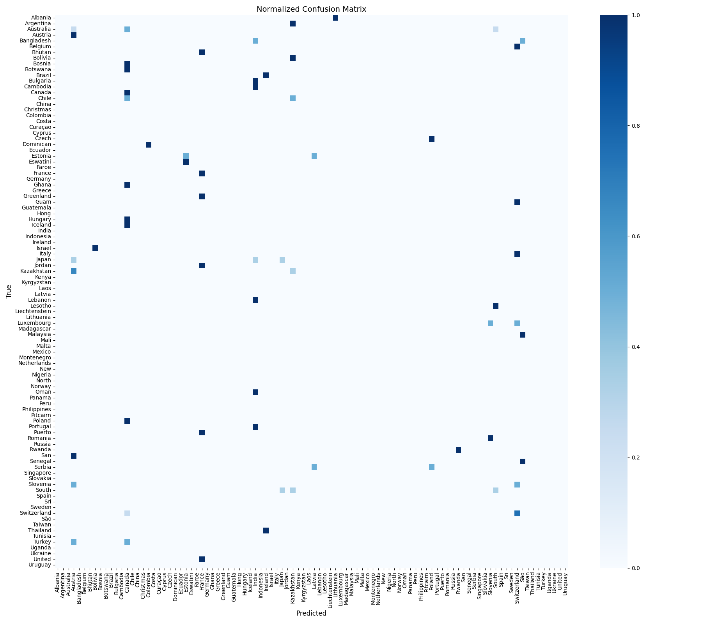
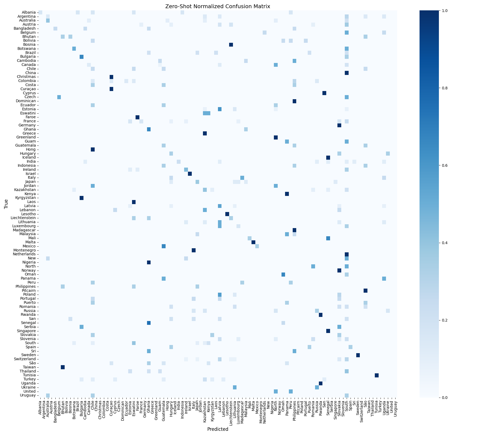

# Utility Pole Classification

## Project Description
This project classifies utility pole images by country using both a fine-tuned ViT model and a zero-shot CLIP model.

### Name & URL
| Name          | URL |
|---------------|-----|
| Huggingface   | [Huggingface Space](https://huggingface.co/spaces/gashiari/Utility-Pole-Classification) |
| Model Page    | [Huggingface Model Page](https://huggingface.co/gashiari/vit-utility-poles) |
| Code          | [GitHub Repository](https://github.com/your-username/vit-utility-poles) |

## Labels
The different pole classes correspond to countries, including:

`['Albania', 'Argentina', 'Australia', 'Austria', 'Bangladesh', 'Belgium', ..., 'Turkey', 'Uganda', 'Ukraine', 'United', 'Uruguay']`  
*(96 total classes)*

## Data Sources and Features Used Per Source
| Data Source | Description |
|-------------|-------------|
| Utility Pole Dataset | A dataset containing labeled images of utility poles from 96 countries. |

## Model Training

### Data Splitting Method (Train/Validation/Test)
| Split      | % of Total  | Approximate Size |
|------------|-------------|------------------|
| Train      | 80%         | —                |
| Validation | 10%         | —                |
| Test       | 10%         | —                |

## Training Results

| Epoch | Training Loss | Validation Loss | Accuracy | Precision | Recall | F1 Score |
|-------|---------------|-----------------|----------|-----------|--------|----------|
| 1     | No log        | 4.4879          | 2.60%    | 0.17%     | 2.60%  | 0.31%    |
| 5     | 3.9392        | 4.2822          | 11.69%   | 11.33%    | 11.69% | 9.26%    |
| 10    | 2.5045        | 4.1706          | 14.29%   | 11.68%    | 14.29% | 10.98%   |
| 15    | 1.6740        | 4.1136          | 16.88%   | 12.85%    | 16.88% | 12.67%   |
| 20    | 1.3136        | 4.1020          | 18.18%   | 13.63%    | 18.18% | 13.47%   |

Full logs and charts available on Hugging Face TensorBoard:  
🔗 [TensorBoard Link](https://huggingface.co/gashiari/vit-utility-poles/tensorboard)

## Results

| Model/Method                                       | Accuracy | Precision | Recall |
|----------------------------------------------------|----------|-----------|--------|
| ViT Fine-Tuned (`google/vit-base-patch16-224`)     | 18.18%   | 13.63%    | 18.18% |
| CLIP Zero-Shot (`openai/clip-vit-base-patch32`)    | 16.0%    | 20%       | 18%    |

## Gradio App

Upload an image of a utility pole to see predictions from both models.

App: [Huggingface Space](https://huggingface.co/spaces/gashiari/Utility-Pole-Classification)

## References
  
  
